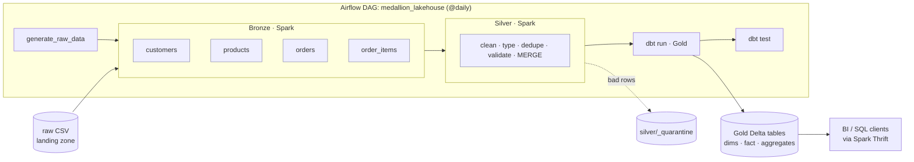

# 🏅 Medallion Lakehouse  Spark + dbt + Airflow

An end-to-end, fully containerised **medallion architecture** (Bronze → Silver → Gold) lakehouse built with open-source tools:

| Layer | Tool | Responsibility |
|-------|------|----------------|
| Orchestration | **Apache Airflow** | Schedules and sequences the whole pipeline |
| Bronze & Silver | **Apache Spark (PySpark) + Delta Lake** | Raw ingestion, cleaning, de-duplication, data-quality quarantine |
| Gold | **dbt (dbt-spark)** | Business-ready dimensional models, aggregates, and tests |
| Storage | **Delta Lake** on a shared volume | ACID tables, `MERGE` upserts, partition-level overwrites |

> The project generates its own messy e-commerce data (duplicates, bad emails, blank IDs, negative quantities…), so you can run it end to end with **no external datasets or cloud accounts**.

---

## Architecture



### Layer contracts

| Layer | Contents | Guarantees |
|-------|----------|-----------|
| **Raw** | CSV files per entity per day: `raw/<entity>/ds=YYYY-MM-DD/` | Immutable landing zone |
| **Bronze** | Delta, all columns as `STRING` + `_ingest_ts`, `_source_file`, `_batch_date` | Exact copy of source with lineage; idempotent per-date reload (`replaceWhere`) |
| **Silver** | Delta, typed & standardised, one row per business key | Deduplicated (latest wins), validated, upserted with `MERGE`; failures isolated in `silver/_quarantine/<entity>` with a `_dq_errors` reason |
| **Gold** | Delta tables built by dbt | Star schema + aggregates; covered by dbt tests (`unique`, `not_null`, `relationships`, `accepted_values`) |

---

## Repository layout

```
.
├── airflow/dags/medallion_lakehouse_dag.py   # Orchestration DAG
├── spark/jobs/
│   ├── common.py                             # Spark session (Delta) + path helpers
│   ├── generate_data.py                      # Synthetic messy source data
│   ├── bronze_ingest.py                      # Raw  -> Bronze
│   └── silver_transform.py                   # Bronze -> Silver (+ quarantine)
├── dbt/lakehouse/
│   ├── dbt_project.yml / profiles.yml
│   ├── macros/                               # schema naming + Silver table registration
│   └── models/
│       ├── sources.yml                       # Silver tables as dbt sources
│       └── gold/                             # dims, fact, aggregates, tests (schema.yml)
├── docker/airflow.Dockerfile                 # Airflow + Java + PySpark + dbt (isolated venv)
├── docker-compose.yml                        # Airflow + Spark Thrift Server + shared volume
├── Makefile                                  # up / trigger / query / clean
└── .github/workflows/ci.yml                  # lint + compile checks
```

---

## Data model

**Source entities:** `customers`, `products`, `orders`, `order_items`

**Gold models (dbt)**

| Model | Grain | Description |
|-------|-------|-------------|
| `dim_customers` | customer | Current customer attributes, email validity flag |
| `dim_products` | product | Product name, category, list price |
| `fct_order_items` | order line | Quantity, price, discount, **net revenue** |
| `agg_daily_sales` | day | Orders, units, net revenue, average order value |
| `agg_sales_by_category` | day × category | Units and net revenue |
| `agg_customer_ltv` | customer | Lifetime revenue, order count, `high/mid/low` value segment |

Revenue metrics count only `shipped` and `completed` orders.

### Data-quality rules (Silver)

| Entity | Rules (failure → quarantine) |
|--------|-----------------------------|
| customers | `customer_id` present, `updated_at` parseable. Invalid emails are *nulled and flagged* (`is_email_valid=false`) rather than dropped |
| products | `product_id` present, `unit_price > 0` |
| orders | `order_id`, `customer_id`, `order_ts` present; status in `placed/shipped/completed/cancelled/returned` |
| order_items | keys present, `quantity > 0`, `unit_price > 0`, `0 ≤ discount_pct ≤ 100` |

---

## Quick start

**Prerequisites:** Docker + Docker Compose (≈ 6 GB RAM free recommended).

```bash
git clone <your-repo-url> medallion-lakehouse && cd medallion-lakehouse

make up          # build images, start Spark Thrift Server + Airflow
make password    # prints the Airflow admin password (user: admin)
```

1. Open **http://localhost:8080** and log in as `admin`.
2. Trigger the `medallion_lakehouse` DAG (or run `make trigger`).
3. Watch it flow: `generate_raw_data → bronze.* → silver.* → dbt_run → dbt_test`.

> First run downloads Delta jars from Maven for the Thrift server, so give it a minute.

### Query the results

```bash
make tables      # list Silver and Gold tables
make query       # sample Gold query
```

Or connect any SQL client / BI tool to the Spark Thrift Server at `jdbc:hive2://localhost:10000`:

```sql
-- Top customers
select * from gold.agg_customer_ltv order by lifetime_revenue desc limit 10;

-- Revenue by category
select category, sum(net_revenue) as revenue
from gold.agg_sales_by_category group by category order by revenue desc;

-- What did data quality reject?
select _dq_errors, count(*) from delta.`/opt/lakehouse/silver/_quarantine/order_items`
group by _dq_errors;
```

### Backfill / re-run a date

Every stage is **idempotent** (partition `replaceWhere` in Bronze, `MERGE` in Silver, table rebuild in Gold), so re-running is safe:

```bash
docker compose exec airflow airflow dags backfill medallion_lakehouse -s 2024-02-01 -e 2024-02-05
```

### Run a stage by hand

```bash
docker compose exec airflow bash
python /opt/airflow/spark/jobs/generate_data.py --ds 2024-03-01
python /opt/airflow/spark/jobs/bronze_ingest.py --entity orders --ds 2024-03-01
python /opt/airflow/spark/jobs/silver_transform.py --entity orders --ds 2024-03-01
```

### Tear down

```bash
make down    # stop containers, keep data
make clean   # stop containers and delete the lakehouse volume
```

---

## How the pieces fit together

- **Airflow** runs Spark jobs in local mode inside its container and invokes dbt from an isolated virtualenv (avoids dependency conflicts with Airflow).
- **Spark Thrift Server** is the SQL endpoint dbt connects to. All containers share one volume (`/opt/lakehouse`).
- Before each dbt run, an `on-run-start` macro registers the Silver Delta folders as catalog tables (`silver.*`) so dbt can use them via `source()`.
- dbt writes Gold as Delta tables under `/opt/lakehouse/gold/`.

## Design decisions

- **Bronze stores strings only** so a schema surprise upstream never breaks ingestion; typing happens in Silver.
- **Quarantine instead of drop** – bad records are kept with their failure reasons for triage and replay.
- **Gold uses inner joins** from facts to dimensions to guarantee referential integrity; dbt `relationships` tests enforce it.
- **dbt for Gold, Spark for Bronze/Silver** – dbt shines at SQL transformations, lineage, and tests; Spark handles file ingestion and complex cleansing.

---

## Moving to production

This repo is a learning/reference setup. For production consider:

- Replace `airflow standalone` (SQLite + SequentialExecutor) with Postgres + Celery/Kubernetes executor.
- Run Spark on a real cluster (Kubernetes, EMR, Databricks, Dataproc) and use `SparkSubmitOperator`.
- Swap the shared volume for object storage (S3/ADLS/GCS) and a persistent Hive Metastore or Unity Catalog.
- Add `dbt source freshness`, `dbt docs generate`, Slack/email alerting, and unit tests for Spark transforms.
- Add incremental dbt models for large fact tables.

## Roadmap

- [ ] Incremental Gold models and SCD2 customer dimension
- [ ] Great Expectations / Soda checks at the Bronze→Silver boundary
- [ ] Streaming ingestion (Kafka → Bronze with Structured Streaming)
- [ ] Dashboards (Superset / Metabase) on top of Gold

## Troubleshooting

| Symptom | Fix |
|---------|-----|
| `dbt_run` can't connect to Thrift | Wait for `spark-thrift` to finish downloading jars (`docker compose logs spark-thrift`); Airflow retries automatically |
| Can't find Airflow password | `make password` |
| Out-of-memory in Spark | Increase Docker memory; lower `SHUFFLE_PARTITIONS` |
| Start from a clean slate | `make clean && make up` |

## Tech versions

Airflow 2.9 · Spark 3.5.1 · Delta Lake 3.1 · dbt-core 1.8 / dbt-spark 1.8 · Python 3.11 · Java 17

## License

MIT
